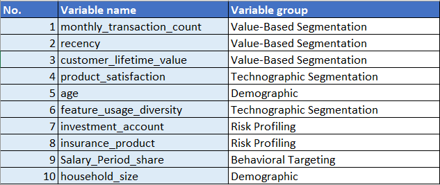
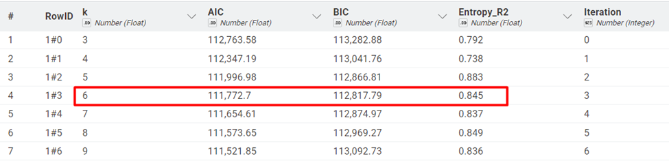
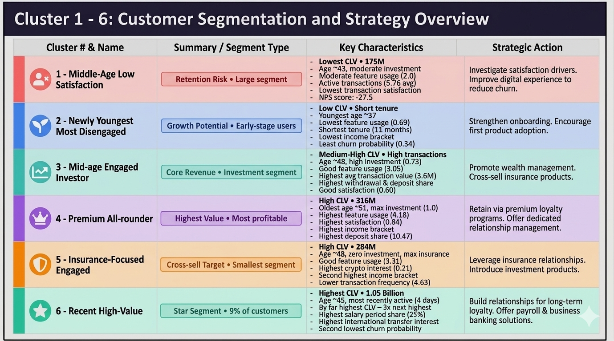
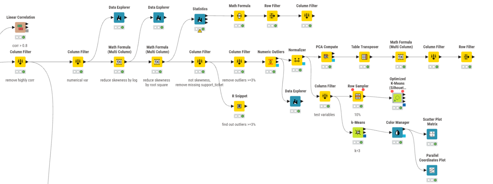

# Customer Segmentation Analysis for Colombian Fintech

*Data Analytics Project*

A multi-dimensional customer segmentation study using Latent Class Analysis (LCA) to identify 6 distinct customer personas from 48,723 customers and 3.1M transactions.

## 1. Business Challenge

A leading Colombian fintech company needed to understand their diverse customer base to:

-   Improve targeted marketing effectiveness
-   Reduce churn in at-risk segments
-   Identify cross-selling opportunities
-   Optimize resource allocation across customer groups

## 2. Methodology

**Data Scope:** 48,723 customers \| 3.1M transactions \| 58 variables

**Analysis Framework:**

-   Behavioral Targeting
-   Risk Profiling
-   Technographic Segmentation
-   Value-Based Segmentation

**Key Steps:**

1.  Selected significant variables, Feature Engineering
2.  Compared K-Means vs. Latent Class Analysis models
3.  Selected optimal model (LCA with 6 clusters, Entropy R² = 0.845)
4.  Created actionable customer personas

## 3. Key Findings

**6 customer segments discovered**

After analyzing business domain and checking correlation value, 10 variables are remained.I will run LCA clustering trials to find out the most suitable number of latent clusters. At k = 6, BIC gets lowest point and Entropy_R^~2~^ reaches a high point of 0.845.

The value of features in each cluster are visualized by Parallel Coordinates Plot.

**Customer Personas and Business Recommendation**

-   Cluster 4 and 6 demand the highest retention investment as top CLV contributors with strong engagement.
-   Cluster 3 and 5 offer clear cross-sell pathways - investment products for insurance-focused customers and insurance for investor-focused ones.
-   Cluster 1 requires proactive re-engagement to address the satisfaction gap before churn accelerates across this large segment.
-   Cluster 2, while currently low-value, represents the future customer base and benefits most from structured onboarding programs that build early product habits and long-term loyalty.

## 4. Technical Summary

**Tools & Methods:**

-   KNIME Analytics Platform
-   Latent Class Analysis (LCA)
-   Principal Component Analysis (PCA)
-   Feature Engineering & Selection
-   Data Binning & Transformation

**Model Performance:**

-   Entropy R²: 0.845 (exceeds 0.8 threshold)
-   BIC: 112,817.79
-   10 variables across 4 business dimensions
-   Silhouette comparison: LCA \>\> K-Means (0.139)

## 5. Workflow

This analysis is conducted on KNIME Analytics Platform.

Feel free to explore the full workflow here: <https://hub.knime.com/s/p7LaJUaJYsiFkF47>.
