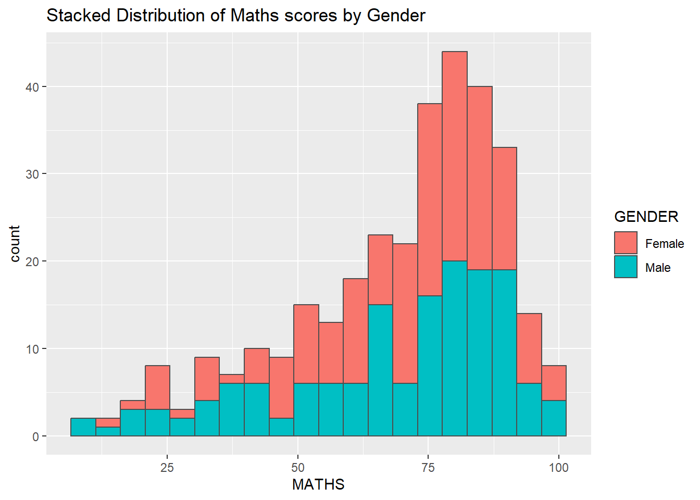

# 1.1 Getting Started

After reading this page, you can draw this chart by yourself!



## 1.1.1 Install and launching R packages

The code chunk below uses p_load() of pacman package to check if tidyverse packages are installed in the computer. If they are, then they will be launched into R.

```{r}
pacman::p_load(tidyverse)

```

## 1.1.2 Importing the data

```{r}
exam_data <- read_csv("data/Exam_data.csv")
```

```{r}
head(exam_data, n = 10)
```

# 1.2 Plotting different chart types

## 1.2.1 Bar chart

```{r}
p1 <- ggplot(data=exam_data, 
       aes(x=RACE)) +
  geom_bar() +
  ggtitle("Number of students by Nationalities")
p1

```

```{r}
p1 + coord_flip()
```

```{r}
p1 + theme_linedraw()

```

## 1.2.3 Histogram chart

```{r}
ggplot(data=exam_data, aes(x = MATHS)) +
  geom_histogram(bins=10, 
                 boundary = 100,
                 color="black", 
                 fill="light blue") +
  ggtitle("Distribution of Maths scores")

```

```{r}
ggplot(data=exam_data, 
       aes(x = MATHS)) +
  geom_dotplot(binwidth=2.5,         
               dotsize = 0.5) +      
  scale_y_continuous(NULL,           
                     breaks = NULL)  +
  ggtitle("Distribution of Maths scores")
```

```{r}
ggplot(data=exam_data, 
       aes(x= MATHS, 
           fill = GENDER)) +
  geom_histogram(bins=20, 
                 color="grey30") +
  ggtitle("Stacked Distribution of Maths scores by Gender")
```

```{r}
ggplot(data=exam_data, 
       aes(x = MATHS, 
           colour = GENDER)) +
  geom_density() +
  ggtitle("Density of Maths scores by Gender")
```

## 1.2.4 Box plot

```{r}
ggplot(data=exam_data, 
       aes(y = MATHS, 
           x= GENDER)) +
  geom_boxplot(notch=TRUE) +
  ggtitle("Boxplot of Maths scores by Gender")
```

## 1.2.5 Violin plot

```{r}
ggplot(data=exam_data, 
       aes(y = MATHS, 
           x= GENDER)) +
  geom_violin() +
  ggtitle("Violin plot of Math scores by Gender")
```

## 1.2.6 Scatter plot

```{r}
ggplot(data=exam_data, 
       aes(x= MATHS, 
           y=ENGLISH)) +
  geom_point() +
  geom_smooth(method=lm, 
              linewidth=0.5) +
  ggtitle("Scatter plot between Math and English scores")
```

```{r}
ggplot(data=exam_data, 
       aes(x= MATHS, y=ENGLISH)) +
  geom_point() +
  geom_smooth(method=lm, 
              size=0.5) +  
  coord_cartesian(xlim=c(0,100),
                  ylim=c(0,100)) +
  ggtitle("Scatter plot between Math and English scores, equal axis")
```

## 1.2.7 Combination chart types

```{r}
ggplot(data=exam_data, 
       aes(y = MATHS, 
           x= GENDER)) +
  geom_boxplot() +                    
  geom_point(position="jitter", 
             size = 0.5) +
  ggtitle("Scatter and box plots of Math scores by Gender")
```

```{r}
ggplot(data=exam_data, 
       aes(y = MATHS, x= GENDER)) +
  geom_boxplot() +
  stat_summary(geom = "point",       
               fun = "mean",         
               colour ="red",        
               size=4)               
```

```{r}
ggplot(data=exam_data, 
       aes(x= MATHS)) +
  geom_histogram(bins=20) +
  facet_wrap(~ CLASS) +
  ggtitle("facet_wrap()")

```

```{r}
ggplot(data=exam_data, 
       aes(x= MATHS)) +
  geom_histogram(bins=20) +
  facet_grid(~ CLASS) +
  ggtitle("facet_grid()")
```
