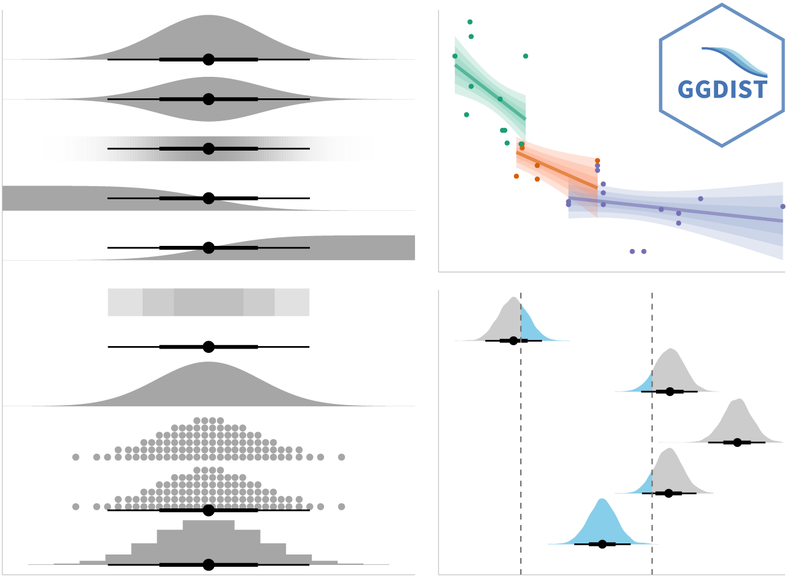

# 7.1 Learning Outcome

Visualising uncertainty is relatively new in statistical graphics. In this chapter, you will gain hands-on experience on creating statistical graphics for visualising uncertainty. By the end of this chapter you will be able:

-   to plot statistics error bars by using ggplot2,
-   to plot interactive error bars by combining ggplot2, plotly and DT,
-   to create advanced by using ggdist, and
-   to create hypothetical outcome plots (HOPs) by using ungeviz package.

After reading this page, you can create Uncertainty visualization with Hypothetical Outcome Plots as below.

```{r}
#| echo: false
pacman::p_load(plotly, crosstalk, DT, 
               ggdist, ggridges, colorspace,
               gganimate, tidyverse,
               ggplot)

library(ungeviz)

exam <- read_csv("data/Exam_data.csv")


ggplot(data = exam, 
       (aes(x = factor(RACE), 
            y = MATHS))) +
  geom_point(position = position_jitter(
    height = 0.3, 
    width = 0.05), 
    size = 0.4, 
    color = "#0072B2", 
    alpha = 1/2) +
  geom_hpline(data = sampler(25, 
                             group = RACE), 
              height = 0.6, 
              color = "#D55E00") +
  theme_bw() + 
  transition_states(.draw, 1, 3)
```

# 7.2 Getting Started

## 7.2.1 Installing and loading the packages

For the purpose of this exercise, the following R packages will be used, they are:

-   tidyverse, a family of R packages for data science process,
-   plotly for creating interactive plot,
-   gganimate for creating animation plot,
-   DT for displaying interactive html table,
-   crosstalk for for implementing cross-widget interactions (currently, linked brushing and filtering), and
-   ggdist for visualising distribution and uncertainty.

```{r}
pacman::p_load(plotly, crosstalk, DT, 
               ggdist, ggridges, colorspace,
               gganimate, tidyverse,
               ggplot)
```

## 7.2.2 Data import

For the purpose of this exercise, *Exam_data.csv* will be used.

```{r}
exam <- read_csv("data/Exam_data.csv")
```

# 7.3 Visualizing the uncertainty of point estimates: ggplot2 methods

A point estimate is a single number, such as a mean. Uncertainty, on the other hand, is expressed as standard error, confidence interval, or credible interval.

::: callout-important
Don’t confuse the uncertainty of a point estimate with the variation in the sample.
:::

In this section, you will learn how to plot error bars of maths scores by race by using data provided in *exam* tibble data frame.

Firstly, code chunk below will be used to derive the necessary summary statistics.

```{r}
my_sum <- exam %>%
  group_by(RACE) %>%
  summarise(
    n=n(),
    mean=mean(MATHS),
    sd=sd(MATHS)
    ) %>%
  mutate(se=sd/sqrt(n-1))
```

::: callout-tip
## Things to learn

-   group_by() of dplyr package is used to group the observation by RACE
-   summarise() is used to compute the count of observations, mean, standard deviation
-   mutate() is used to derive standard error of Maths by RACE
-   the output is save as a tibble data table called my_sum.
:::

Next, the code chunk below will be used to display my_sum tibble data frame in an html table format.

```{r}
knitr::kable(head(my_sum), format = 'html')
```

## 7.3.1 Plotting standard error bars of point estimates

Now we are ready to plot the standard error bars of mean maths score by race as shown below.

```{r}
ggplot(my_sum) +
  geom_errorbar(
    aes(x=RACE, 
        ymin=mean-se, 
        ymax=mean+se), 
    width=0.2, 
    colour="black", 
    alpha=0.9, 
    linewidth=0.5) +
  geom_point(aes
           (x=RACE, 
            y=mean), 
           stat="identity", 
           color="red",
           size = 1.5,
           alpha=1) +
  ggtitle("Standard error of mean maths score by rac")
```

## 7.3.2 Plotting confidence interval of point estimates

Instead of plotting the standard error bar of point estimates, we can also plot the confidence intervals of mean maths score by race.

```{r}
ggplot(my_sum) +
  geom_errorbar(
    aes(x=reorder(RACE, -mean), 
        ymin=mean-1.96*se, 
        ymax=mean+1.96*se), 
    width=0.2, 
    colour="black", 
    alpha=0.9, 
    linewidth=0.5) +
  geom_point(aes
           (x=RACE, 
            y=mean), 
           stat="identity", 
           color="red",
           size = 1.5,
           alpha=1) +
  labs(x = "Maths score",
       title = "95% confidence interval of mean maths score by race")
```

## 7.3.3 Visualizing the uncertainty of point estimates with interactive error bars

In this section, you will learn how to plot interactive error bars for the 99% confidence interval of mean maths score by race as shown in the figure below.

```{r}
shared_df = SharedData$new(my_sum)

bscols(widths = c(4,8), #Creates a two-column layout — left column takes 4/12 width (plot), right column takes 8/12 width (table)
       ggplotly((ggplot(shared_df) +
                   geom_errorbar(aes(
                  x=reorder(RACE, -mean),   # sort races from highest-lowest mean
                  ymin=mean-2.58*se,        # lower bound of 99% CI
                  ymax=mean+2.58*se),       # upper bound of 99% CI
                  width=0.2,                # width of the error bar caps
                  colour="black",           # bar color
                  alpha=0.9,                # slight transparency
                  size=0.5) +               # bar thickness
                   geom_point(aes(
                     x=RACE, 
                     y=mean, 
                     text = paste("Race:", `RACE`,  # hover tooltip line 1
                                  "<br>N:", `n`,    # hover tooltip line 2
                                 "<br>Avg. Scores:", round(mean, digits=2),# hover tooltip line 3
                                 "<br>95% CI:[",   # hover tooltip line 4  
                                  round((mean-2.58*se), digits = 2), ",",
                                  round((mean+2.58*se), digits = 2),"]")),
                    stat="identity",          # use values as-is
                    color="red",              # red dots
                    size=1.5,                 # dot size
                    alpha=1) +                # fully opaque 
                   xlab("Race") + 
                   ylab("Average Scores") + 
                   theme_minimal() + 
                   theme(axis.text.x = element_text(
                      angle = 45,           # rotate x labels 45 degrees
                      vjust = 0.5,          # vertical adjustment
                      hjust=1),             # horizontal adjustment
                      xis.text = element_text(size = 7),# x and y axis tick labels
                      axis.title = element_text(size = 8),# "Race"+"Average Scores"
                      plot.title = element_text(size = 8)) +# chart title
                                 
                   ggtitle("99% Confidence interval of average /<br>maths scores by race")), 
                tooltip = "text"), 
       DT::datatable(shared_df,            # use same shared data (linked to plot)
                rownames = FALSE,          # hide row numbers
                class="compact display",           # compact table style
                width="100%",              # full width
                options = list(
                  pageLength = 10,         # show 10 rows per page
                  scrollX=T),              # enable horizontal scrolling
                colnames = c("No. of pupils", # rename column headers
                             "Avg Scores",
                             "Std Dev",
                             "Std Error")) %>%
         formatRound(columns=c('mean', 'sd', 'se'),
                     digits=2))
```

# 7.4 Visualising Uncertainty: ggdist package

-   **ggdist** is an R package that provides a flexible set of ggplot2 geoms and stats designed especially for visualising distributions and uncertainty.

-   It is designed for both frequentist and Bayesian uncertainty visualization, taking the view that uncertainty visualization can be unified through the perspective of distribution visualization:

    -   for frequentist models, one visualises confidence distributions or bootstrap distributions (see vignette(“freq-uncertainty-vis”));
    -   for Bayesian models, one visualises probability distributions (see the tidybayes package, which builds on top of ggdist).



## 7.4.1 Visualizing the uncertainty of point estimates: ggdist methods, pointinterval

In the code chunk below, [`stat_pointinterval()`](https://mjskay.github.io/ggdist/reference/stat_pointinterval.html) of **ggdist** is used to build a visual for displaying distribution of maths scores by race.

```{r}
exam %>%
  ggplot(aes(x = RACE, 
             y = MATHS)) +
  stat_pointinterval() +
  labs(
    title = "Visualising confidence intervals of mean math score",
    subtitle = "Mean Point + Multiple-interval plot")
```

How to show 95% and 99% confidence intervals?

```{r}
exam %>%
  ggplot(aes(x = RACE, 
             y = MATHS)) +
  stat_pointinterval(
    .width = c(0.95, 0.99),
    show.legend = TRUE) +   
  labs(
    title = "Visualising confidence intervals of mean math score",
    subtitle = "Mean Point + Multiple-interval plot")
```

Add color to differentiate 0.95 and 0.99 interval

```{r}
exam %>%
  ggplot(aes(x = RACE, y = MATHS)) +
  stat_pointinterval(
    .width = c(0.95, 0.99),
    aes(interval_color = after_stat(level)),
    show.legend = TRUE) +                      
  scale_color_manual(
    values = c("0.95" = "blue", 
               "0.99" = "red"),
    aesthetics = "interval_color") +
  labs(
    title = "Visualising confidence intervals of mean math score",
    subtitle = "Mean Point + Multiple-interval plot"
    )
```

## 7.4.2 Visualizing the uncertainty of point estimates: ggdist methods, gradientinterval

In the code chunk below, [`stat_gradientinterval()`](https://mjskay.github.io/ggdist/reference/stat_gradientinterval.html) of **ggdist** is used to build a visual for displaying distribution of maths scores by race.

```{r}
exam %>%
  ggplot(aes(x = RACE, 
             y = MATHS)) +
  stat_gradientinterval(   
    fill = "skyblue",      
    show.legend = TRUE     
  ) +                        
  labs(
    title = "Visualising confidence intervals of mean math score",
    subtitle = "Gradient + interval plot")
```

# 7.5 Visualising Uncertainty with Hypothetical Outcome Plots (HOPs)

## 11.5.1 Installing & launch ungeviz package

Note: You only need to perform this step once.

`devtools::install_github("wilkelab/ungeviz")`

```{r}
library(ungeviz)
```

## 7.5.3 Visualising Uncertainty with Hypothetical Outcome Plots (HOPs)

Next, the code chunk below will be used to build the HOPs.

```{r}
ggplot(data = exam, 
       (aes(x = factor(RACE), 
            y = MATHS))) +
  geom_point(position = position_jitter(
    height = 0.3, 
    width = 0.05), 
    size = 0.4, 
    color = "#0072B2", 
    alpha = 1/2) +
  geom_hpline(data = sampler(25, 
                             group = RACE), 
              height = 0.6, 
              color = "#D55E00") +
  theme_bw() + 
  transition_states(.draw, 1, 3)
```
