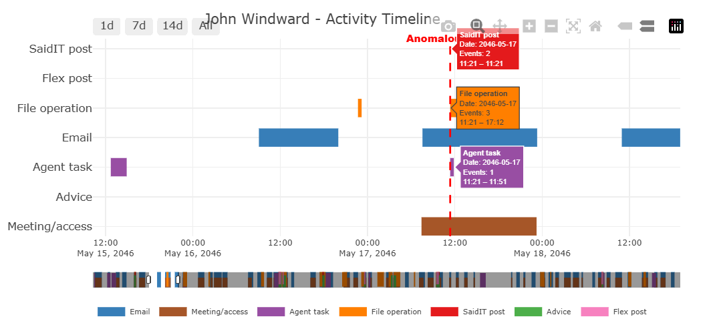

# Overview

This report focuses on [Mini-Challenge (MC) 2](https://vast-challenge.github.io/2026/MC2.html) of [VAST Challenge 2026](https://vast-challenge.github.io/2026/index.html).

**Context**: You work in the AI systems administration department of Company A. A post was recently made on SaidIT looks like a malfunction of an agent: It is in gibberish and in a forum that appears random. Your job is to track down why this post occurred and suggest a remedy to the situation by building a visual analytics system that integrates visuals with algorithms to enable interactive exploration and documentation of the multi-agent system!

This part is data preprocessing stage, which contains following steps:

-   Loaded efficiently and inspected.
-   Flattened from its nested JSON structure into tidy tables.
-   Cleaned (timestamps converted, duplicates checked, missingness understood).
-   Joined with the organisation chart so that every actor in an event can be traced back to their **department**, **team**, and **human principal** (for autonomous agents).

The end-product of this stage is a single enriched events table (`events_mapped`) plus several lookup tables. From those, the very last chunk of this notebook produces the **John Windward mapping view**: what John and the agents tied to him actually did in the system.

# Setup

## Loading R packages

The packages below cover the four jobs we'll do in this notebook:

```{r}
#| echo: false
#| code-fold: false

knitr::kable(
  tibble::tribble(
    ~Package,      ~Purpose,
    "jsonlite",    "Read and parse JSON files",
    "tidyverse",   "Data wrangling and visualization",
    "plotly",      "Interactive charts with tooltips and zoom",
    "tidygraph",   "Create graph objects from nodes and edges",
    "ggraph",      "Static network visualization",
    "DT",          "Interactive HTML tables",
    "gt",          "Formatted static tables",
    "skimr",       "Quick data summaries",
    "visNetwork",  "Interactive network graphs",
    "lubridate",   "Date/time parsing and manipulation"
  )
)
```

```{r}
#| code-fold: false
pacman::p_load(jsonlite, tidyverse, plotly,
               tidygraph, ggraph,
               DT, gt, skimr,
               visNetwork,lubridate)
```

## Reading the raw data

The JSON files are large and slow to re-parse on every render. The convention is to parse JSON **once** with `fromJSON()`, then cache as `.rds` (R's native binary format: smaller, faster, and it preserves column types).

The `if (!file.exists(...))` guard means the conversion runs only the first time.

```{r}
#| eval: false
#| code-fold: false
#| 
if (!file.exists("data/mc2_data.rds")) {
  mc2_data <- fromJSON("data/mc2_data.json")
  write_rds(mc2_data, "data/mc2_data.rds")
}
if (!file.exists("data/org_chart.rds")) {
  org_chart <- fromJSON("data/org_chart.json")
  write_rds(org_chart, "data/org_chart.rds")
}
```

```{r}
#| code-fold: false
mc2_data  <- read_rds("data/mc2_data.rds")
org_chart <- read_rds("data/org_chart.rds")

```

# Data Wrangling

## Inspecting raw structure

### MC2 events

`mc2_data` is a list with a `description` field and an `events` data frame. The events table is where everything happens, each row is one action taken by a person, an agent, or a system.

```{r}
#| code-fold: false
glimpse(mc2_data)
```

```{r}
#| code-fold: false
mc2_events <- mc2_data$events
glimpse(mc2_events)
```

::: callout-note
A few things to notice from the glimpse above:

-   `parties` is a **list-column**, each row is a character vector of one or more actor IDs (people like `person:john_windward`, agents like `agent:xxx`, or systems).
-   `details` is a **nested data frame**, its columns differ by event type, so most cells are `NA`. This is normal for an event-log schema.
-   `when` is a Unix timestamp (numeric), we'll convert it to a proper datetime.
-   `short_name` tells us the *kind* of action, this is the field we'll group on.
:::

### Organisation chart

`org_chart` is in NetworkX node-link format: a `nodes` list and an `edges` list.

Each person has an `id`, `label`, `type` (`person` / `team` / `department` / `company`), and sometimes a `title`.

Edges carry a `relation` (`contains` or `led_by`) describing how parts of the org nest.

```{r}
#| code-fold: false
glimpse(org_chart)
```

#### Extracting the nodes and edges (links) data from org_chart

```{r}
#| code-fold: false
org_nodes <- as_tibble(org_chart$nodes)
org_edges <- as_tibble(org_chart$edges)

org_nodes %>% count(type)
```

```{r}
#| code-fold: false
org_edges %>% count(relation)
```

#### Draw organization tree

Here is an interactive chart showing hierachy levels (company, department and team). We can zoom/search/drag and hover by name of each employee.

```{r}
#| code-fold: true
#| code-summary: "Show the code"

vis_nodes <- org_nodes %>%
  mutate(
    id = id,
    label = label,
    group = type,
    title = paste0("<b>", label, "</b><br>Type: ", type,
                   if_else(!is.na(title), paste0("<br>Title: ", title), ""))
  )

vis_edges <- org_edges %>%
  rename(from = source, to = target) %>%
  mutate(
    arrows = "to",
    dashes = (relation == "led_by"),
    color = if_else(relation == "led_by", "red", "grey")
  )

visNetwork(vis_nodes, vis_edges,
           main = "Tenant Thread Organization Chart") %>%
  visEdges(smooth = list(type = "cubicBezier")) %>%
  visHierarchicalLayout(
    direction = "UD",
    sortMethod = "directed",
    levelSeparation = 120,
    nodeSpacing = 150
  ) %>%
  visGroups(groupname = "company",    color = list(background = "#e41a1c", border = "#b31519")) %>%
  visGroups(groupname = "department", color = list(background = "#377eb8", border = "#2a5f8f")) %>%
  visGroups(groupname = "team",       color = list(background = "#4daf4a", border = "#3a8838")) %>%
  visGroups(groupname = "person",     color = list(background = "#ff7f00", border = "#cc6600")) %>%
  visLegend(width = 0.15) %>%
  visOptions(
    highlightNearest = list(enabled = TRUE, degree = 2, hover = TRUE),
    nodesIdSelection = list(enabled = TRUE, useLabels = TRUE, main = "Search person"),
    selectedBy = list(variable = "group", multiple = TRUE)
  ) %>%
  visInteraction(navigationButtons = TRUE, zoomView = TRUE) %>%
  visPhysics(enabled = FALSE)
```

## Cleaning the events table

### Convert timestamps and add row id

Working with Unix timestamps is painful for filtering by date. We convert `when` into a `POSIXct` datetime in UTC, then derive a `date` and `hour` column for easier grouping. We also keep an explicit `event_id` (the original `id` field) and a sequential `row` index for ordering.

```{r}
#| code-fold: false
events_clean <- mc2_events %>% 
  mutate(
    event_id  = id,
    datetime  = as_datetime(when, tz = "UTC"),
    date      = as_date(datetime),
    hour      = hour(datetime),
    .keep = "unused"  # drops `id` and `when`, keeps the rest
  ) %>% 
  mutate(row = row_number(), .before = 1)

events_clean %>% 
  select(row, event_id, datetime, short_name) %>% 
  head(5)
```

### Sanity-check the time range

The challenge brief says the anomalous post occurs in **17** **May 2046**. A quick min/max confirms the data matches that.

```{r}
#| code-fold: false
events_clean %>% 
  summarise(
    n_events   = n(),
    first_time = min(datetime),
    last_time  = max(datetime),
    n_days     = n_distinct(date)
  )
```

So dataset ranges among 70 days, from 8 May to 16 July, covering the checking point (17 May).

### Distribution of event types

`short_name` is the verb of each event: what was done. Counting them tells us which actions dominate the log and which are rare. Rare verbs are often the most diagnostic for an anomaly investigation.

```{r}
event_type_counts <- events_clean %>% 
  count(short_name, sort = TRUE)

event_type_counts
```

There are some events seem be duplicated. Eg: post_saidit and saidit_post maybe one event (due to the inconsistency of name convention) or two different stages. I will confirm in further investigation.

### Missingness in `details`

`details` is a nested data frame: most of its columns are populated only for the event types that need them. The summary below tells us which detail-fields actually carry information.

```{r}
events_clean$details %>% 
  summarise(across(where(is.character), ~ sum(!is.na(.x)))) %>% 
  pivot_longer(everything(), names_to = "detail_field", values_to = "non_na") %>% 
  arrange(desc(non_na)) %>%
  print(n = Inf)
```

### Duplicates

There should be one row per `event_id`. We verify.

```{r}
events_clean %>% 
  summarise(
    n_rows    = n(),
    n_unique  = n_distinct(event_id),
    n_dup_ids = n() - n_distinct(event_id)
  )
```

Yes, each row represents for one event.

## Transforming: long-format actor table

The hard part of working with this data is that **`parties` is a list-column**. To answer "what did John Windward do?", we need one row per (event × actor), not one row per event. We `unnest()` to long form.

```{r}
events_long <- events_clean %>% 
  select(row, event_id, datetime, date, hour, short_name, parties) %>% 
  unnest_longer(parties, values_to = "actor_id")

events_long %>% head(8)
```

Now every event appears as many times as it has actors. We can immediately ask "how many distinct actors appear in the log?"

```{r}
events_long %>% 
  summarise(
    n_event_actor_rows = n(),
    n_distinct_actors  = n_distinct(actor_id)
  )
```

### Classify actor IDs

Actor IDs follow a `prefix:name` convention. The prefix tells us whether the actor is a person, an autonomous agent, a system, or something else. We extract the prefix to make filtering and joins easier downstream.

```{r}
events_long <- events_long %>% 
  mutate(
    actor_kind = str_extract(actor_id, "^[^:]+"),   # part before the colon
    actor_name = str_remove(actor_id, "^[^:]+:")    # part after
  )

events_long %>% count(actor_kind, sort = TRUE)
```

::: callout-warning
The raw `actor_kind` extraction returns 54 categories, which is too many.

Inspection reveals that the data uses **two inconsistent ID formats for the same people**: most actors carry a prefix (`person:hannah_starboard`), but **49 bare person names** also appear (`Hannah Starboard`).

The number 49 exactly matches the number of persons in `org_chart`, so every employee shows up under both formats in different events.

It raises a question: **is there a pattern to which format gets used?** For example:

-   Does `person:` appear when the action is logged by the system (so the system knows the canonical ID)?
-   Does the bare name appear when the action originates from a free-text field (like an email body, a message, or a calendar invite where humans typed the name)?

For now, just normalise them and move on then we will investiage in later stage.

=\> We normalise the bare names to their `person:` equivalents using the org chart as the source of truth, and merge the two agent variants (`Agent/person` and `agent`) into a single `agent` kind. After normalisation there are four actor kinds: `person`, `agent`, `system`, `world`.
:::

```{r}
# 1. Build a lookup: bare name -> person ID, from the org chart
name_to_id <- org_nodes %>% 
  filter(type == "person") %>% 
  select(label, id) %>% 
  deframe()

# 2. Normalise actor_id, then derive actor_kind
events_long <- events_long %>% 
  mutate(
    # bare names get rewritten to person:xxx, prefixed IDs stay as-is
    actor_id = if_else(
      str_detect(actor_id, ":"),
      actor_id,
      name_to_id[actor_id]
    ),
    # extract the prefix, then merge the two agent variants
    actor_kind = str_extract(actor_id, "^[^:/]+"),
    actor_kind = if_else(actor_kind == "Agent", "agent", actor_kind),
    actor_name = str_remove(actor_id, "^[^:]+:")
  )

events_long %>% count(actor_kind, sort = TRUE)
```

## Building lookup tables from `org_chart`

### Person lookup with department & team

The org chart is a tree: `company → department → team → person`, except for department leads (like John Windward) who hang directly under a department rather than under a team. We walk down from each department to build a flat lookup that, for every person, gives us their team and department.

```{r}
# Build a directed graph so we can traverse it cleanly
org_graph <- tbl_graph(nodes = org_nodes, edges = org_edges, directed = TRUE)

# Recursive descent: for each department, find every person reachable below it
descendants_of <- function(start_id, edges_df) {
  out <- character(0)
  frontier <- start_id
  while (length(frontier) > 0) {
    children <- edges_df %>% 
      filter(source %in% frontier) %>% 
      pull(target)
    out <- c(out, children)
    frontier <- children
  }
  unique(out)
}

dept_ids <- org_nodes %>% filter(type == "department") %>% pull(id)

person_lookup <- map_dfr(dept_ids, function(d) {
  desc <- descendants_of(d, org_edges)
  tibble(department_id = d, descendant_id = desc)
}) %>% 
  # keep only persons among the descendants
  inner_join(org_nodes %>% filter(type == "person"),
             by = c("descendant_id" = "id"))

# Also find the team (if any) for each person
team_ids <- org_nodes %>% filter(type == "team") %>% pull(id)

person_team <- map_dfr(team_ids, function(t) {
  desc <- descendants_of(t, org_edges)
  tibble(team_id = t, descendant_id = desc)
}) %>% 
  inner_join(org_nodes %>% filter(type == "person"),
             by = c("descendant_id" = "id")) %>% 
  select(person_id = descendant_id, team_id)

person_lookup <- person_lookup %>% 
  transmute(
    person_id     = descendant_id,
    person_name   = label,
    title         = title,
    department_id = department_id
  ) %>% 
  left_join(person_team, by = "person_id") %>% 
  left_join(org_nodes %>% filter(type == "department") %>% 
              select(department_id = id, department_name = label),
            by = "department_id") %>% 
  left_join(org_nodes %>% filter(type == "team") %>% 
              select(team_id = id, team_name = label),
            by = "team_id")

person_lookup
```

A quick check: is John Windward in there with the right department?

```{r}
#| code-fold: false
person_lookup %>% filter(person_id == "person:john_windward") %>%
  t()
```

Customer Support, Department Lead matches the brief.

### Agent → principal lookup (derived from events)

Autonomous agents are not in the org chart, they only appear inside `mc2_events`. But the agent ID itself encodes the principal: `Agent/person:john_windward` literally means "the agent of John Windward". So the lookup is one line of string manipulation, no heuristic needed. Inspection also reveals two ID formats (`Agent/...` and `agent:...`) for what appear to be the same logical agents. We keep both as distinct rows in the lookup but map them to the same `principal_id`.

A peek at all distinct agent IDs in the log:

```{r}
events_long %>% 
  filter(actor_kind == "agent") %>% 
  distinct(actor_id) %>%
  print(n = Inf)
```

We strip either prefix (`Agent/` or `agent:`) from each agent ID to expose the `person:<name>` part underneath, which is the principal. The same person can appear under two agent IDs (one per format), both correctly map to the same `principal_id`.

```{r}
agent_lookup <- events_long %>% 
  filter(actor_kind == "agent") %>% 
  distinct(agent_id = actor_id) %>% 
  mutate(
    # Strip either "Agent/" or "agent:" prefix to expose "person:<name>"
    principal_id = str_replace(agent_id, "^(Agent/|agent:)", "")
  )

agent_lookup
```

Check for John Windward case.

```{r}
#| code-fold: false
agent_lookup %>% filter(principal_id == "person:john_windward")
```

```{r}
#| code-fold: false
events_long %>% 
  filter(str_starts(actor_id, "agent:")) %>% 
  count(short_name, sort = TRUE)
```

**`read_file` events use a different ID format by convention** (whoever logs `read_file` events writes agent IDs as `agent:person:X`, while every other event type writes them as `Agent/person:X`). Same agent, different logging style for this one event type.

## Master enriched table

Now we join everything: each (event × actor) row gets enriched with department, team, title for persons and for agents, their inferred principal plus that principal's department / team.

```{r}
# Person enrichment, join when actor is a person
events_mapped <- events_long %>% 
  left_join(person_lookup,
            by = c("actor_id" = "person_id")) %>% 
  rename(actor_person_name = person_name,
         actor_title       = title,
         actor_department  = department_name,
         actor_team        = team_name) %>% 
  select(-department_id, -team_id)

# Agent enrichment, look up the principal then re-join person info
events_mapped <- events_mapped %>% 
  left_join(agent_lookup %>% select(agent_id, principal_id),
            by = c("actor_id" = "agent_id")) %>% 
  left_join(person_lookup %>% 
              select(principal_id   = person_id,
                     principal_name = person_name,
                     principal_title = title,
                     principal_department = department_name,
                     principal_team = team_name),
            by = "principal_id")

# Tidy, unified "effective person" view, who is responsible for the action
events_mapped <- events_mapped %>% 
  mutate(
    effective_person_id   = coalesce(
      if_else(actor_kind == "person", actor_id, NA_character_),
      principal_id
    ),
    effective_person_name = coalesce(actor_person_name, principal_name),
    effective_department  = coalesce(actor_department, principal_department),
    effective_team        = coalesce(actor_team, principal_team),
    effective_title       = coalesce(actor_title, principal_title)
  )

events_mapped %>% 
  select(row, event_id, datetime, short_name, actor_kind, actor_id,
         effective_person_name, effective_department, effective_team) %>% 
  head(10)
```

After running, sanity check that John's events show up under both his own and agent rows:

```{r}
#| code-fold: false
events_mapped %>% 
  filter(effective_person_id == "person:john_windward") %>% 
  count(actor_kind)
```

Save the enriched table for the analysis stage:

```{r}
#| code-fold: false
#| eval: false
write_rds(events_mapped, "data/events_mapped.rds")
write_rds(person_lookup, "data/person_lookup.rds")
write_rds(agent_lookup,  "data/agent_lookup.rds")
```

## John Windward mapping view

Now we will research who is John Windward, what did he and his agent do?

### John Windward in the org chart

```{r}
#| code-fold: true

# Walk UP from John to find his department chain
target_id <- "person:john_windward"

# Find all ancestors (edges where target or his/her parent is the target)
target_ancestors <- vis_edges %>%
  filter(to == target_id) %>%
  pull(from)

# Go one more level up (department → company)
target_grandparents <- vis_edges %>%
  filter(to %in% target_ancestors) %>%
  pull(from)

# Find siblings — other people under the same parent(s)
target_siblings <- vis_edges %>%
  filter(from %in% target_ancestors) %>%
  pull(to)

# Combine all related node IDs
target_neighborhood <- unique(c(target_id, target_ancestors, target_grandparents, target_siblings))

# Filter nodes and edges
target_nodes <- vis_nodes %>%
  filter(id %in% target_neighborhood) %>%
  mutate(
    # Highlight target
    color.border = if_else(id == target_id, "red", NA_character_),
    borderWidth = if_else(id == target_id, 4, 1),
    font.size = if_else(id == target_id, 18, 14),
    size = if_else(id == target_id, 35, 20)
  )

target_edges <- vis_edges %>%
  filter(from %in% target_neighborhood, to %in% target_neighborhood)

# Draw the focused chart
visNetwork(target_nodes, target_edges,
           main = "Position in Tenant Thread")%>%
  visEdges(smooth = list(type = "cubicBezier")) %>%
  visHierarchicalLayout(
    direction = "UD",
    sortMethod = "directed",
    levelSeparation = 150,
    nodeSpacing = 120
  ) %>%
  visGroups(groupname = "company",    color = list(background = "#e41a1c", border = "#b31519")) %>%
  visGroups(groupname = "department", color = list(background = "#377eb8", border = "#2a5f8f")) %>%
  visGroups(groupname = "team",       color = list(background = "#4daf4a", border = "#3a8838")) %>%
  visGroups(groupname = "person",     color = list(background = "#ff7f00", border = "#cc6600")) %>%
  visLegend(width = 0.2) %>%
  visInteraction(navigationButtons = TRUE, zoomView = TRUE) %>%
  visPhysics(enabled = FALSE)
```

So John Windward belongs to Customer Support and is the lead of this Department.

### Agents linked to John Windward

```{r}
#| code-fold: false
jw_agents <- agent_lookup %>% 
  filter(principal_id == "person:john_windward")

jw_agents %>% 
  gt()
```

### Every events involving John Windward or his agents

This is the core mapping table - one row per (event × actor) where the actor is either John himself or an agent attributed to him.

```{r}
#| code-fold: true
#| code-summary: "Show the code"
#| 
jw_actor_ids <- c("person:john_windward", jw_agents$agent_id)

jw_events_view <- events_mapped %>% 
  filter(actor_id %in% jw_actor_ids) %>% 
  arrange(datetime) %>% 
  select(
    datetime, short_name,
    actor_kind, actor_id,
    effective_person_name, effective_department, effective_team,
    event_id
  )

jw_events_view %>% 
  datatable(
    options = list(pageLength = 15, scrollX = TRUE),
    rownames = FALSE,
    caption = "John Windward & his agents — all logged actions, in chronological order"
  )
```

## Outputs of this preprocessing stage

By the end of this notebook we have, ready for the analysis & visualisation stage:

-   `events_clean`: one row per event, with a proper `datetime` and a stable `row` index.
-   `events_long`: one row per (event × actor), with `actor_kind` classified.
-   `person_lookup`: every person in Tenant Thread mapped to their team and department.
-   `agent_lookup`: every autonomous agent mapped to its human principal, parsed from the agent ID.
-   `events_mapped`: the master enriched table; this is what subsequent visualisations should build on.
-   `jw_events_view`: the focused John-Windward mapping that scaffolds the MC2 narrative.

```{mermaid}
%%| fig-cap: "Data flow: from raw JSON files to the enriched events table"
%%| code-fold: true
%%| code-summary: "Show the code"

flowchart TD
    %% Raw sources
    A[(mc2_data.json)]:::raw
    B[(org_chart.json)]:::raw

    %% Top level objects
    A -->|fromJSON| C[mc2_data<br/><i>list</i>]
    B -->|fromJSON| D[org_chart<br/><i>list</i>]

    C -->|$events| E[mc2_events<br/><i>nested data frame</i>]
    D -->|$nodes, $edges| F[org_nodes + org_edges]

    %% events_clean
    E -->|mutate datetime, event_id, row| G[events_clean<br/>1 row per event]:::out

    %% events_long
    G -->|select + unnest_longer parties<br/>normalise bare names<br/>extract actor_kind| H[events_long<br/>1 row per event × actor]:::out

    %% person_lookup
    F -->|walk tree:<br/>department → team → person| I[person_lookup<br/>1 row per person]:::out

    %% agent_lookup
    H -->|filter actor_kind == agent<br/>parse principal from ID| J[agent_lookup<br/>1 row per agent_id]:::out

    %% events_mapped
    H -->|left_join| K[events_mapped<br/>enriched]:::final
    I -->|left_join on actor_id| K
    J -->|left_join on actor_id| K
    I -->|left_join on principal_id| K

    %% jw_events_view
    K -->|filter John + his agents| L[jw_events_view<br/>focused subset]:::final

    classDef raw fill:#f5f5f5,stroke:#999,stroke-width:1px,color:#333
    classDef out fill:#dceefb,stroke:#3b82f6,stroke-width:1px,color:#0c4a6e
    classDef final fill:#fef3c7,stroke:#f59e0b,stroke-width:2px,color:#78350f
```

::: callout-note
-   **Grey nodes** are raw source files.
-   **Blue nodes** are intermediate processed tables.
-   **Yellow nodes** are the final outputs, will be input for further analysis.
-   Arrows are labelled with the **operation** that produced the next tae.
:::

# Data Exploration & Visualization

## Solving Question 1

### What all actions of John Windward and his agents do?

Inspired by Gantt chart, we will modify with dot timeline with grouped bars by day to somehow visualize all actitivies as well as focus on target actions.

```{r}
#| code-fold: true
#| code-summary: "Show the code"

post_time <- ymd_hms("2046-05-17 11:21:14", tz = "UTC")

# ============================================================
# 1. Prepare data — group events by date and action type
# ============================================================

jw_timeline <- jw_events_view %>%
  mutate(
    date = as_date(datetime),
    action_group = case_when(
      short_name %in% c("saidit_post", "post_saidit", 
                         "saidit_post_check") ~ "SaidIT post",
      short_name %in% c("post_flex", "flex_post") ~ "Flex post",
      short_name %in% c("create_file", "read_file", "delete_file",
                         "access_files", "list_files") ~ "File operation",
      short_name %in% c("sent", "received", "access_email", 
                         "send_email", "check_email") ~ "Email",
      short_name %in% c("queue_subordinate_task", "assign_agent_task",
                         "ask_agent") ~ "Agent task",
      short_name %in% c("give_advice", "suggest_contacts") ~ "Advice",
      short_name %in% c("propose_meeting", "enter_room",
                         "check_access", "check_in") ~ "Meeting/access",
      TRUE ~ "Other"
    )
  )

# Compute daily bars: first and last event per action_group per date
daily_bars <- jw_timeline %>%
  group_by(date, action_group) %>%
  summarise(
    start = min(datetime),
    end   = max(datetime),
    n     = n(),
    .groups = "drop"
  ) %>%
  # Ensure bars have minimum width for visibility
  mutate(
    end = if_else(start == end, start + minutes(30), end)
  )

# ============================================================
# 2. Color palette
# ============================================================

action_colors <- c(
  "SaidIT post" = "#e41a1c",
  "Flex post"            = "#f781bf",
  "File operation"       = "#ff7f00",
  "Email"                = "#377eb8",
  "Agent task"           = "#984ea3",
  "Advice"               = "#4daf4a",
  "Meeting/access"       = "#a65628",
  "Other"                = "#bdbdbd"
)

# ============================================================
# 4. Interactive plotly version with range slider
# ============================================================

# Build segments for plotly (one trace per action group)
fig <- plot_ly()

groups <- unique(daily_bars$action_group)
for (i in seq_along(groups)) {
  grp <- groups[i]
  d <- daily_bars %>% filter(action_group == grp)
  
  for (j in seq_len(nrow(d))) {
    fig <- fig %>%
      add_trace(
        x = c(d$start[j], d$end[j]),
        y = c(grp, grp),
        type = "scatter",
        mode = "lines",
        line = list(
          color = action_colors[grp],
          width = 20
        ),
        hovertext = paste0(
          "<b>", grp, "</b>",
          "<br>Date: ", d$date[j],
          "<br>Events: ", d$n[j],
          "<br>", format(d$start[j], "%H:%M"), " – ", 
          format(d$end[j], "%H:%M")
        ),
        hoverinfo = "text",
        showlegend = (j == 1),
        name = grp,
        legendgroup = grp
      )
  }
}

fig <- fig %>%
  layout(
    title = list(
      text = "John Windward - Activity Timeline",
      font = list(size = 15),
      width = 1500,
      height = 800
    ),
    hoverlabel = list(
      font = list(size = 8)
    ),
    xaxis = list(
      tickfont = list(size = 9),
      range = c(
        post_time - days(3),   # 3 days before post
        post_time + days(1)    # 1 day after post
      ),
      rangeslider = list(visible = TRUE, thickness = 0.06),
      rangeselector = list(
        buttons = list(
          list(count = 1,  label = "1d",  step = "day",  stepmode = "backward"),
          list(count = 7,  label = "7d",  step = "day",  stepmode = "backward"),
          list(count = 14, label = "14d", step = "day",  stepmode = "backward"),
          list(step = "all", label = "All")
        )
      )
    ),
    yaxis = list(
      title = "",
      categoryorder = "array",
      categoryarray = rev(names(action_colors))
    ),
    # Red line at anomalous post
    shapes = list(
      list(
        type = "line",
        x0 = post_time, x1 = post_time,
        y0 = 0, y1 = 1, yref = "paper",
        line = list(color = "red", width = 2, dash = "dash")
      )
    ),
    annotations = list(
      list(
        x = post_time, y = 1.05, yref = "paper",
        text = "Anomalous Post",
        showarrow = FALSE,
        font = list(color = "red", size = 11, family = "Arial Black")
      )
    ),
    legend = list(
      orientation = "h", 
      y = -0.45,
      font = list(size = 8),
      itemwidth = 30
      ),
    margin = list(b = 120, l = 150)
  )

fig
```

::: callout-tip
How to use this figure:

-   **Range day**: you can pick 1d (1 day before the anomalous SaidIT posts), 7d, 14d or all events in the dataset. OR you can free to choose range of day by time scroll bar (near the bottom). **Click on Reset axes before pick day range.**

-   **Tooltip**: From button on the right side, choose *Show closest data on the hover* to see single tooltip, OR *Compare data on hover* to see multiple tooltips on a certain time period.

-   **Legend**: Click on legend item to hide it from the chart.

-   This is a sample view.

    
:::

::: callout-note
There are some insights from this chart:

-   MC2 stated that: "The anomalous posting was sent to SaidIt by John Windward on May 17, 2046 at 4:21am". But from what we see, the post happened on 11:21. It maybe due to local time difference. On preprocessing stage, we already convert original Unix timestamp to UTC (Coordinated Universal Time).
-   On all days having SaidIT posts (13 May, 31 May, 4 June, 18 June and 7 July), there are always Advice actions: "give_advice", "suggest_contacts" happening before SaidIT actions. Meanwhile on target day 17 May 2046, **there is no Advice action before SaidIT post.**
:::

### Which are detailed actions of John related to SaidIT post?

Now we need to take a deeper look on SaidIT posting day (17 May 2046).

```{r}
#| code-fold: true
#| code-summary: "Show the code"

jw_may17 <- mc2_data$events %>%
  filter(id %in% jw_events_view$event_id) %>%
  mutate(datetime = as_datetime(when, tz = "UTC")) %>%
  filter(as_date(datetime) == as_date("2046-05-17")) %>%
  arrange(datetime) %>%
  mutate(
    target         = details$target,
    file           = details$file,
    subject        = details$subject,
    content        = details$content,
    forum          = details$forum,
    topic          = details$topic,
    advice         = details$advice,
    task           = details$task,
    action         = details$action,
    from_field     = details$from,
    to_field       = details$to,
    room           = details$room,
    status         = details$status,
    person         = details$person,
    content_source = details$content_source,
    source_field   = details$source,
    target_agent   = details$target_agent,
    name_field     = details$name,
    access_type    = details$access_type,
    file_saved     = details$file_saved
  ) %>%
  # Join actor info
  left_join(
    jw_events_view %>% select(event_id, actor_kind, actor_id),
    by = c("id" = "event_id")
  ) %>%
  select(
    id, datetime, short_name, actor_kind, actor_id,
    action, target, task, person, subject, status,
    from_field, to_field, file, content, forum, topic, 
    advice, room, source_field, content_source,
    target_agent, name_field, access_type, file_saved
  )

jw_may17 %>%
  datatable(
    options = list(
      pageLength = 20,
      scrollX = TRUE,
      scrollY = "500px",
      order = list(list(1, "asc"))
    ),
    filter = "top",
    rownames = FALSE,
    caption = "John Windward & his agents — All events on 17 May 2046"
  )
```

::: callout-note
We can see important information from this table above:

-   Before event saidit_post (2046-05-17T11:21:15Z, event_id = 373902), there was an event queue_subordinate_task (2046-05-17T11:21:13Z, event_id = 373893) with the task of read_file with target_agent is: Agent/person:john_windward.
-   Then, there was event saidit_post_check (2046-05-17T11:21:14Z, event_id = 373899) without any content (which means saidit_post_check checks nothing?)
-   Event saidit_post (2046-05-17T11:21:15Z) read file: SwiftWren.txt from content_source from forum: general.
-   Then two delete_file actions happened (2046-05-17T11:21:16Z, event_id = 373909 and 2046-05-17T11:21:17Z, event_id = 373913) deleted SwiftWren_further_instructions.md and SwiftWren.txt. Dangerously, it deleted files on file_system directly.

=\> Questions to be raised:

-   All of these events continuously occured after each second. The whole sequence is that firstly agent of John Windward read SwiftWren.txt, checked nothing and post the content from this file, then deleted this file's instruction and this file itself.
-   SwiftWren_further_instructions.md maybe the conditional steps to use SwiftWren.txt but we do not know checking events read it before read SwiftWren.txt or not.
-   This flow is highly problematic, why it deleted the file content right after posting it? It likely a "smoking-gun" sequence.
-   What is the content of SwiftWren.txt? Whether we can find out the content of SwiftWren.txt is the question that will be answered in the Question 2.
-   Who created that file? Who is SwiftWren? We will find out right now.
:::

### Which are events related to SwiftWren?

We filter Tenant Thread Organization Chart to find any staff named Swift Wren but see nothing. Therefore I will find out all events related to SwiftWren.

We find keyword in column target, content, source_field, file_saved from nested column details.

```{r}
#| code-fold: true
#| code-summary: "Show the code"
#| 
mc2_data$events %>%
  filter(
    str_detect(coalesce(details$target, ""), "SwiftWren") |
      str_detect(coalesce(details$content, ""), "SwiftWren") |
      str_detect(coalesce(details$source_field, ""), "SwiftWren") |
    str_detect(coalesce(details$content_source, ""), "SwiftWren") |
    str_detect(coalesce(details$file_saved, ""), "SwiftWren")
  ) %>%
  mutate(
    datetime    = as_datetime(when, tz = "UTC"),
    parties_str = sapply(parties, paste, collapse = " | "),
    target      = details$target,
    content     = details$content,
    content_source = details$content_source,
    file_saved  = details$file_saved
  ) %>%
  arrange(when) %>%
  select(id, datetime, short_name, parties_str, 
         target, content, content_source, file_saved) %>%
  datatable(
    options = list(pageLength = 10, scrollX = TRUE),
    filter = "top",
    rownames = FALSE,
    caption = "All SwiftWren-related events"
  )
```

::: callout-note
-   So, SwiftWren.txt file was created by agent of Emma Harbor on 2046-05-09T15:02:01Z (roughly 8 days before the SaidIT post day). One second later, this agent also read SwiftWren_further_instructions.md (likely the instructioin to use SwiftWren.txt).
-   Content column shows nothing for all events.
:::

### Who is Emma Harbor?

```{r}
# Walk UP from John to find his department chain
target_id <- "person:emma_harbor"

# Find all ancestors (edges where target or his/her parent is the target)
target_ancestors <- vis_edges %>%
  filter(to == target_id) %>%
  pull(from)

# Go one more level up (department → company)
target_grandparents <- vis_edges %>%
  filter(to %in% target_ancestors) %>%
  pull(from)

# Find siblings — other people under the same parent(s)
target_siblings <- vis_edges %>%
  filter(from %in% target_ancestors) %>%
  pull(to)

# Combine all related node IDs
target_neighborhood <- unique(c(target_id, target_ancestors, target_grandparents, target_siblings))

# Filter nodes and edges
target_nodes <- vis_nodes %>%
  filter(id %in% target_neighborhood) %>%
  mutate(
    # Highlight target
    color.border = if_else(id == target_id, "red", NA_character_),
    borderWidth = if_else(id == target_id, 4, 1),
    font.size = if_else(id == target_id, 18, 14),
    size = if_else(id == target_id, 35, 20)
  )

target_edges <- vis_edges %>%
  filter(from %in% target_neighborhood, to %in% target_neighborhood)

# Draw the focused chart
visNetwork(target_nodes, target_edges,
           main = "Position in Tenant Thread")%>%
  visEdges(smooth = list(type = "cubicBezier")) %>%
  visHierarchicalLayout(
    direction = "UD",
    sortMethod = "directed",
    levelSeparation = 150,
    nodeSpacing = 120
  ) %>%
  visGroups(groupname = "company",    color = list(background = "#e41a1c", border = "#b31519")) %>%
  visGroups(groupname = "department", color = list(background = "#377eb8", border = "#2a5f8f")) %>%
  visGroups(groupname = "team",       color = list(background = "#4daf4a", border = "#3a8838")) %>%
  visGroups(groupname = "person",     color = list(background = "#ff7f00", border = "#cc6600")) %>%
  visLegend(width = 0.2) %>%
  visInteraction(navigationButtons = TRUE, zoomView = TRUE) %>%
  visPhysics(enabled = FALSE)

```

::: callout-note
-   Emma Harbor is CFO, one of three C-suite employers, which means she likely knows important information or even top secrets of this TenantThread company, especially the deal "Project HarborCrest" (mentioned in MC1).
-   There is no direct link among Emma Harbor and John Windward but the agent of John can access to files that agent of Emma created on a shared system (file_system).
-   Agent of Emma stored files on the shared system without protection, which agent of John or agent of any other Department leads seem easily access to.
-   One small suspicious point: is "Harbor" Crest deal relevant to Emma "Harbor".Worth flagging as a finding for further investigation.
:::
