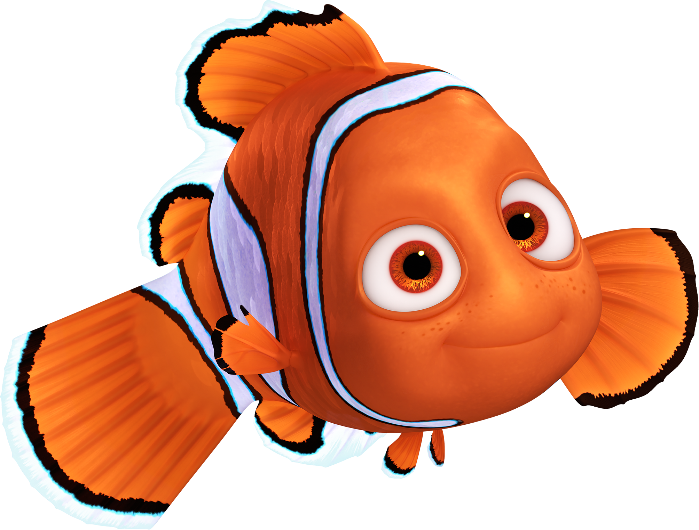

{width="45"} Like Nemo, I'm on a journey. Driven by curiosity and navigated by data. Always swimming forward.

I am deeply grateful to **Professor Kam Tim Seong**, who taught me something beyond textbooks, which is the sense of responsibility and dedication to the craft of analytics and visualization.

**Nguyen Kim Hau**

📧 [kh.nguyen.2025\@mitb.smu.edu.sg](mailto:kh.nguyen.2025@mitb.smu.edu.sg) or [haukimng\@gmail.com](mailto:haukimng@gmail.com)

💼 [linkedin.com/in/haukim](https://www.linkedin.com/in/haukim)

🌐 [haukim.vercel.app](https://haukim.vercel.app)
